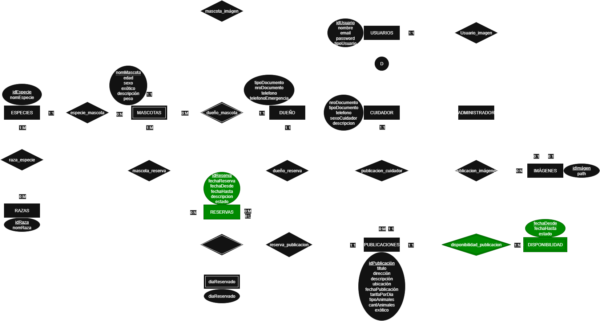

### Integrantes

52147 - Aguirrezabala, Pilar

52664 - Giacone, Alessandro

## Tema
### Descripción
La aplicación web "Petsbnb" que permite conectar dueños y cuidadores de mascotas quienes ofrecen sus servicios de cuidado por un periodo determinado. Dentro de su funcionamiento se contemplan dos tipos de usuarios principales. El tipo de usuario "Cuidador" puede registrar una o varias publicaciones donde ofrece su hogar y/o servicio de cuidado, definiendo qué tipo de animales acepta, por cuánto tiempo, si puede cuidar animales exóticos, descripción, tarifas y disponibilidad. Este recibe reservas por parte de los dueños y decide si las acepta o las rechaza; el "Dueño" quien registra a sus mascotas en el sistema con detalles relevantes (edad, especie, necesidades específicas, etc) y busca cuidadores según se adapte a las necesidades del animal teniendo la posibilidad de solicitar una reserva de una publicación determinando la fecha y realizando el pago de la misma.

### Modelo

## Alcance Funcional
### Alcance Mínimo
Regularidad:
| Req  | Detalles |
|:-|:-|
| CRUD simple   | 1. CRUD Dueño   2. CRUD Cuidador |
| CRUD dependiente      | 1. CRUD Publicación {depende de} CRUD Cuidador   2. CRUD Mascota {depende de} CRUD Dueño   3. CRUD Imagen {depende de} CRUD Publicación/Mascota/Usuario |
| Listado + detalles  | 1. Listado de publicaciones filtrado por atributo exótico => detalle muestra publicaciones de cuidadores |
| CUU | 1. Crear mascota |

Aprobación:
| Req  | Detalles |
|:-|:-|
| CRUD | 1. CRUD Reserva   2. CRUD Disponibilidad   3. CRUD Pago    4. CRUD Raza   5. CRUD Especie|
| CUU | 1. Crear publicación    2. Realizar reserva|
