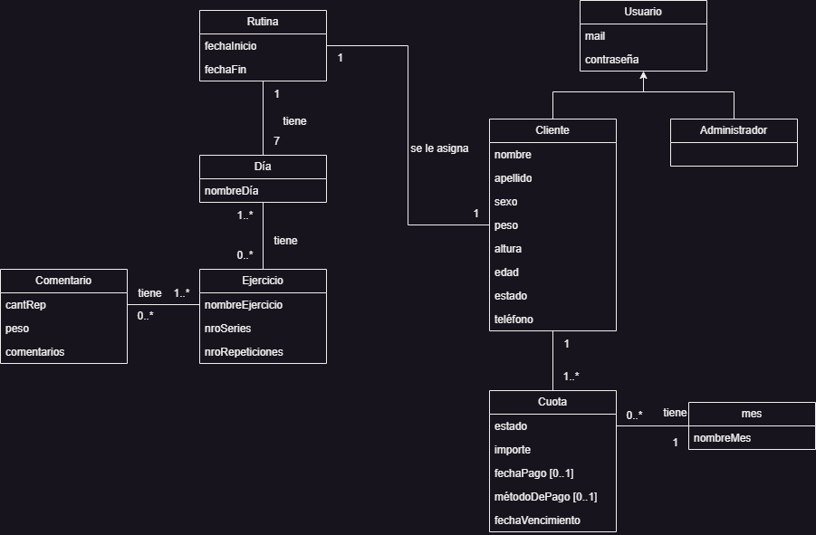

### Integrantes

52147 - Aguirrezabala, Pilar

52664 - Giacone, Alessandro

### Repositorios

* [FrontEnd App](https://github.com/AleGiacone/FrontEnd)
* [BackEnd App](https://github.com/AleGiacone/BackEnd)

## Tema
### Descripción

Una aplicación web orientada a la administración de rutinas de entrenamiento personalizadas. La plataforma estará dirigida a un administrador, encargado de la gestión de rutinas y clientes, y a los clientes, quienes podrán acceder a sus programas de entrenamiento mediante una suscripción mensual. Como usuario administrador, dentro de sus funcionalidades podrá realizar la administración de rutinas para poder visualizar la lista de clientes con sus pagos al día, seleccionar clientes para modificar y actualizar sus rutinas de entrenamiento y asignar ejercicios específicos a cada cliente, detallando repeticiones, series y videos instructivos. Además, dentro de la administración de clientes, se podrá consultar el estado de pago de cada cliente, modificar información personal y estado de suscripción y dar de baja a clientes con pagos vencidos. Como usuario cliente, dentro de sus funcionalidades podrá visualizar su rutina para acceder a los ejercicios asignados por el administrador, junto a videos tutoriales de cada ejercicio. Además, como gestor de suscripción, podrá realizar el pago mensual para el acceso a la rutina y solicitar la baja al servicio en cualquier momento.

### Modelo

## Alcance Funcional
### Alcance Mínimo
Regularidad:
| Req  | Detalles |
|:-|:-|
| CRUD simple   | 1. CRUD Ejercicio   2. CRUD Cliente|
| CRUD dependiente      | 1. CRUD Rutina {depende de} CRUD Ejercicio   |
| Listado + detalles  | 1. Listado de rutina filtrado por día muestra series, repeticiones y nombre de ejercicio => detalle CRUD Ejercicio   |
| CUU | 1. Abonar mensualidad|

Aprobación:
| Req  | Detalles |
|:-|:-|
| CRUD | 1. CRUD Administrador   2. CRUD Cliente   3. CRUD Ejercicio   4. CRUD Rutina   5. CRUD Cuota   6. CRUD Día |
| CUU | 1. Abonar mensualidad   2. CRUD Gestiona rutina clientes  3. Registrar Cliente|

