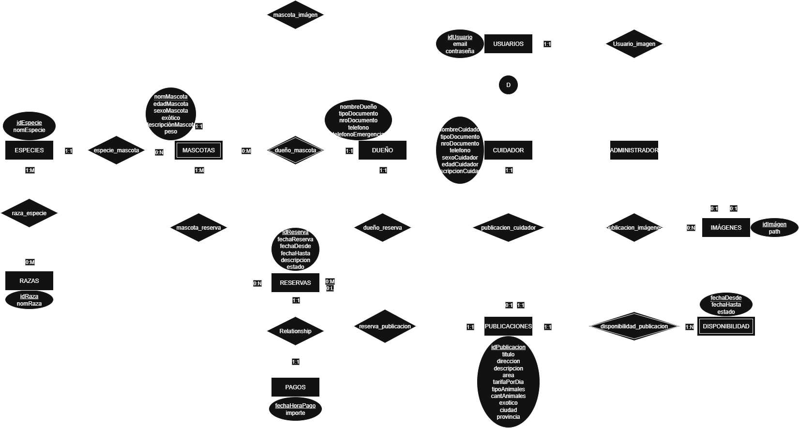

### Integrantes

52147 - Aguirrezabala, Pilar

52664 - Giacone, Alessandro

### Repositorios

* [FrontEnd App](https://github.com/AleGiacone/FrontEnd)
* [BackEnd App](https://github.com/AleGiacone/BackEnd)

## Tema
### Descripción
Una aplicación web de "PATAS" (Plataforma de Alojamiento Temporal y Atención de SeresPeludos) la cual permite conectar cuidadores de mascotas con personas que necesitan dejar sus animales al cuidado de otros por un periodo determinado. Dentro de su funcionamiento se contemplan tres tipos de usuarios principales. El usuario "Administrador" se encarga de supervisar el sistema en general, moderar aplicaciones y reportes con acceso a todos los datos. El tipo de usuario "Cuidador" puede registrar una o varias publicaciones donde ofrece su hogar y servicio de cuidado, definiendo qué tipo de animales acepta, por cuánto tiempo, si puede cuidar animales exóticos, condiciones especiales, tarifas y disponibilidad. Este recibe reservas por parte de los dueños y decide si las acepta o las rechaza. El "Dueño de mascota", registra a sus mascotas en el sistema con detalles relevantes (edad, especie, necesidades específicas, etc) y busca cuidadores según filtros personalizados (ubicaciones, tipo de mascota, fechas, servicios especiales). Así, puede solicitar una reserva para una publicación específica y dejar una reseña al finalizar.

### Modelo

## Alcance Funcional
### Alcance Mínimo
Regularidad:
| Req  | Detalles |
|:-|:-|
| CRUD simple   | 1. CRUD Dueño   2. CRUD Cuidador   3. CRUD Administador|
| CRUD dependiente      | 1. CRUD Publicación {depende de} CRUD Cuidador   2. CRUD Mascota {depende de} CRUD Dueño   3. CRUD Tratamiento {depende de} CRUD Mascota  |
| Listado + detalles  | 1. Listado de publicaciones filtrado por atributo exótico => detalle muestra publicaciones de cuidadores |
| CUU | 1. Registro de dueño   2. Registro de cuidador |

Aprobación:
| Req  | Detalles |
|:-|:-|
| CRUD | 1. CRUD Administrador   2. CRUD Cuidador   3. CRUD Dueño   4. CRUD Mascota   5. CRUD Tratatamiento   6. CRUD Reserva   7. CRUD Publicación   8. CRUD Disponibilidad   9. CRUD Ciudad   10. CRUD Provincia |
| CUU | 1. Realizar reserva   2. Crear publicación  |

### Alcance Adicional Voluntario
| Req  | Detalles |
|:-|:-|
| CUU/Epic| 1. Realizar reseña de reserva|
